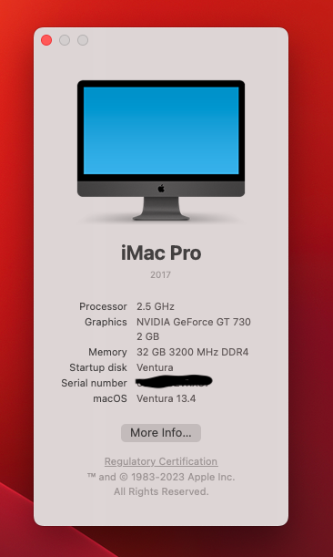
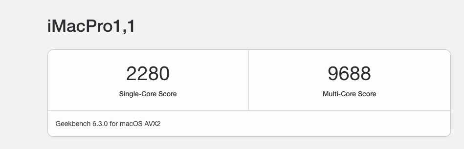

<h3>Hardware:</h3>
<ul>
<li>CPU: Intel Core i5 12400</li>
<li>RAM: Crucial 32GB 3200 DDR4 (Kit of 2)</li>
<li>Motherboard: Gigabyte B660M DS3H AX DDR4</li>
<li>GPU: Gigabyte Nvidia GT 730 GDDR5</li>
<li>SSD: Crucial P3 SSD NVME</li>
<li>Wifi/Bluetooth: Intel® Wi-Fi AX211 / Intel Bluetooth 5.2</li>
<li>Case / PSU: Case XIGMATEK Master X GAMING
 Power Supply 600W 80+ Elite V4</li>
</ul>

<h3>Bootloader:</h3>
PS: These Opencore files are signed via Windows WSL, this will enable you to boot OpenCore while Secure boot option is active in your Motherboard, You don't need to do anything, just enable the option and boot!

<b>Opencore 0.9.3 — iMacPro1,1</b>

<h3>Installation Steps:</h3>
All the required steps are from the official open core guide, please follow it if you need to get the best results, these files only to help you as a simple guide, please use your own if you faced any issues or you have any other hardware.

<h3>Bios Settings</h3>
<b>Disable:</b>
<ul>
    <li>Fast Boot</li>
    <li>CSM</li>
    <li>Thunderbolt(For initial install, as Thunderbolt can cause issues if not setup correctly)</li>
    <li>Intel SGX</li>
    <li>Disable Internal Graphics (Not Supported)</li>
</ul>

<b>Enable:</b>
<ul>
<li>VT-x</li>
<li>Above 4G decoding</li>
<li>Hyper-Threading</li>
<li>Execute Disable Bit</li>
<li>OS type: (Windows 10 Feautres: Ohter)</li>
</ul>

<b>Needed Drivers:</b>

<li>OpenCanCopy</li>
<li>OpenHfsPlus</li>
<li>OpenRuntime</li>
<li>ResetNvramEntry</li>

<b>Kexts:</b>

<li>Airportltlwm</li>
<li>AppleAlc</li>
<li>IntelBluetoothFirmware</li>
<li>IntelBluetoothInjector</li>
<li>Lilu</li>
<li>CPUFriend</li>
<li>NVMeFix ( If you have NVME only )</li>
<li>RestrictEvents</li>
<li>SMCProcessor</li>
<li>SMCSuperIO</li>
<li>USBInjectAll</li>
<li>VirtualSMC</li>
<li>WhateverGreen</li>

All of these steps are identical to Opencore Comet lake, but with some modifications, you should get the same ACPI files and it's included on my repo, it's generic not related to my CPU or manually generated, you can generate your own BTW.
 

